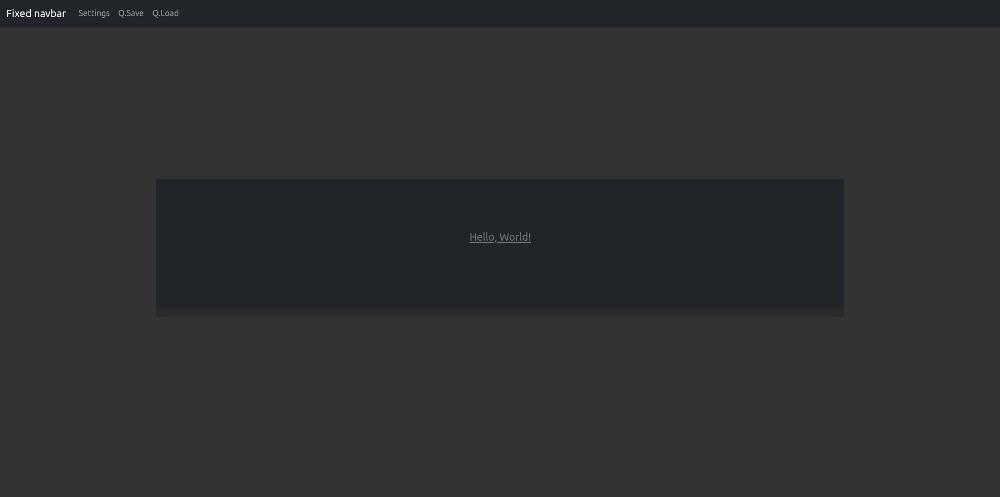

# VN-engine-web

[](https://app.codacy.com/gh/lurkydismal/VN-engine-web/dashboard?utm_source=gh&utm_medium=referral&utm_content=&utm_campaign=Badge_grade)

> Not that Visual, but Novel engine.

## Table of Contents

* [Technologies Used](#technologies-used)
* [Features](#features)
* [Screenshots](#screenshots)
* [Setup](#setup)
* [Usage](#usage)
* [Project Status](#project-status)
* [Room for Improvement](#room-for-improvement)
* [Acknowledgements](#acknowledgements)
* [License](#license)

## Technologies Used

* Typed.js
* Bootstrap

## Features

* Easy to extend.
* Progress saving.
* HTML tags in text.
  ``` html
  _Say( "<strong>Example <span class=\"text-decoration-underline\">Text</span></strong>" );
  ```

## Screenshots




## Setup

> Upgrade dependencies by running
> ``` console
> git init
> git submodule foreach git pull origin master
> ```

## Usage

**Turn on video and audio auto-play.**

Initial page is **./assets/index.html**

## Project Status

Project is: _in progress_.

## Room for Improvement

Room for improvement:

* ¯\\\_\(ツ\)\_/¯

To do:

* Implement more features from RenPy.

## Acknowledgements

* This project was inspired by [_RenPy visual novel engine_](https://www.renpy.org/).
* Many thanks to [_SL1900_](https://github.com/SL1900/).

## License

This project is open source and available under the [GNU General Public License v3.0](https://github.com/lurkydismal/VN-engine-web/blob/main/LICENSE).
