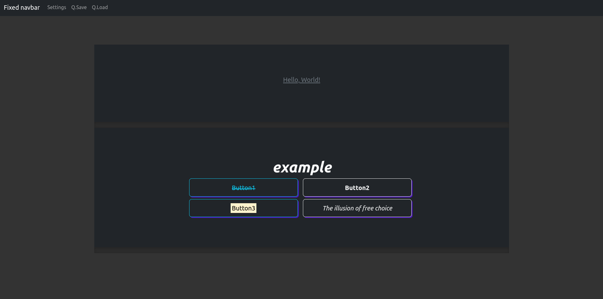

# VN-engine-web

> Not that Visual, but Novel engine.

## Table of Contents

* [Technologies Used](#technologies-used)
* [Features](#features)
* [Screenshots](#screenshots)
* [Setup](#setup)
* [Usage](#usage)
* [Project Status](#project-status)
* [Room for Improvement](#room-for-improvement)
* [Acknowledgements](#acknowledgements)
* [License](#license)

## Technologies Used

* Typed.js - version 2.0.12
* Bootstrap - version 5.1.3

## Features

* Easy to extend.
* Gameplay progess save file.
* HTML tags use in text. `_Say( "<strong>Example Text</strong>" );`

## Screenshots

## Setup

> Upgrade depencies by running  
`git init`  
`git submodule foreach git pull origin master`

## Usage

Initial page is **./assets/index.html**  
Turn on video and audio autoplay.

## Project Status

Project is: _in progress_.

## Room for Improvement

Room for improvement:

* Improve execution speed.
* Improve RAM usage.
* Reduce event hooks count.

To do:

* Add remaining unimplemented features from RenPy.

## Acknowledgements

* This project was inspired by [_RenPy visual novel engine_](https://www.renpy.org/).
* Many thanks to [_SL1900_](https://github.com/SL1900).

## License

This project is open source and available under the [GNU General Public License v3.0](https://github.com/lurkydismal/VN-engine-web/blob/main/LICENSE).
